# AI Task Breakdown Implementation Guide

## 🎯 MVP Goal: AI Task Breakdown Generator (Streaming)

This guide implements a high-value AI feature: **intelligent task breakdown with estimates and assignments** using an MCP server as a POC. Your NestJS API connects to an MCP server that transforms vague requirements into actionable, estimated subtasks for your team.

## 🎨 Architecture (Simple & Secure)

```mermaid
flowchart TD
    U[👤 User] -->|1-click| FE[🖥️ React Frontend]
    FE -->|2-sse| API[⚡ NestJS API]

    subgraph Backend[🔒 Backend Services]
        API -->|3a-project| PS[📊 Projects Service]
        API -->|3b-tasks| TS[📋 Tasks Service]
        API -->|3c-aggregate| SNS[📈 Snapshot Service]
        SNS -->|4-snapshot| AI[🤖 AI Service]
        AI -->|5-mcp-tools| MC[🔧 MCP Client]
    end

    subgraph MCP[📡 MCP Server]
        MC -->|6-get-insights| MS[🧠 MCP Server]
        MS -->|7-llm-call| LLM[🌐 LLM Provider]
        LLM -->|8-response| MS
        MS -->|9-formatted| MC
    end

    MC -->|10-stream| AI
    AI -->|11-events| API
    API -->|12-sse| FE
    FE -->|13-display| U

    classDef user fill:#e1f5fe
    classDef frontend fill:#f3e5f5
    classDef backend fill:#e8f5e8
    classDef mcp fill:#fff8e1
    classDef external fill:#fff3e0

    class U user
    class FE frontend
    class API,PS,TS,SNS,AI backend
    class MC,MS mcp
    class LLM external
```



**Key Principles:**

- ✅ **Frontend never talks to LLM directly** - All LLM calls via your API
- ✅ **Use project context** - Leverage existing ProjectsService, TasksService for context
- ✅ **Streaming for great UX** - Server-Sent Events show subtasks generating in real-time
- ✅ **Actionable output** - Generate ready-to-use tasks with estimates and assignments

## 🚀 Step-by-Step Implementation

### **Step 1: Setup Backend AI Module**

#### **1.1 Install Dependencies**

```bash
cd project-management-api
pnpm add openai
# or for Anthropic: pnpm add @anthropic-ai/sdk
```

#### **1.2 Environment Configuration**

```bash
# project-management-api/.env
LLM_PROVIDER=openai          # or anthropic
LLM_API_KEY=your-api-key-here
LLM_MODEL=gpt-4o-mini        # or claude-3-haiku-20240307
LLM_MAX_TOKENS=2000
```

#### **1.3 Create AI Module Structure**

```bash
# In project-management-api/src/
mkdir ai
cd ai
touch ai.module.ts ai.controller.ts ai.service.ts llm-client.service.ts
```

#### **1.4 AI Module Setup**

```typescript
// src/ai/ai.module.ts
import { Module } from '@nestjs/common';
import { AiController } from './ai.controller';
import { AiService } from './ai.service';
import { LlmClientService } from './llm-client.service';
import { ProjectsModule } from '../projects/projects.module';
import { TasksModule } from '../tasks/tasks.module';

@Module({
  imports: [ProjectsModule, TasksModule],
  controllers: [AiController],
  providers: [AiService, LlmClientService],
})
export class AiModule {}
```

### **Step 2: Core Services Implementation**

#### **2.1 LLM Client Service**

```typescript
// src/ai/llm-client.service.ts
import { Injectable } from '@nestjs/common';
import { ConfigService } from '@nestjs/config';
import OpenAI from 'openai';

export interface StreamResponse {
  type: 'token' | 'final' | 'error';
  text?: string;
  citations?: Array<{ key: string; label: string }>;
  message?: string;
}

@Injectable()
export class LlmClientService {
  private openai: OpenAI;

  constructor(private configService: ConfigService) {
    this.openai = new OpenAI({
      apiKey: this.configService.get<string>('LLM_API_KEY'),
    });
  }

  async *streamCompletion(
    systemPrompt: string,
    userPrompt: string,
    model?: string
  ): AsyncGenerator<StreamResponse> {
    try {
      const stream = await this.openai.chat.completions.create({
        model:
          model || this.configService.get<string>('LLM_MODEL', 'gpt-4o-mini'),
        messages: [
          { role: 'system', content: systemPrompt },
          { role: 'user', content: userPrompt },
        ],
        stream: true,
        max_tokens: this.configService.get<number>('LLM_MAX_TOKENS', 2000),
        temperature: 0.3,
      });

      for await (const chunk of stream) {
        const delta = chunk.choices[0]?.delta;
        if (delta?.content) {
          yield {
            type: 'token',
            text: delta.content,
          };
        }
      }

      yield { type: 'final' };
    } catch (error) {
      yield {
        type: 'error',
        message: error.message || 'LLM request failed',
      };
    }
  }
}
```

#### **2.2 Task Context Service**

```typescript
// src/ai/task-context.service.ts
import { Injectable } from '@nestjs/common';
import { ProjectsService } from '../projects/projects.service';
import { TasksService } from '../tasks/tasks.service';
import { UsersService } from '../users/users.service';

export interface TaskBreakdownRequest {
  title: string;
  description: string;
  projectId: string;
  priority?: 'LOW' | 'MEDIUM' | 'HIGH';
  dueDate?: string;
}

export interface ProjectContext {
  project: {
    id: string;
    name: string;
    description: string;
    techStack: string[];
    teamSize: number;
  };
  team: Array<{
    id: string;
    name: string;
    role: string;
    skills: string[];
    currentWorkload: number;
  }>;
  recentTasks: Array<{
    title: string;
    timeSpent: number;
    complexity: string;
  }>;
}

@Injectable()
export class TaskContextService {
  constructor(
    private projectsService: ProjectsService,
    private tasksService: TasksService,
    private usersService: UsersService
  ) {}

  async getProjectContext(projectId: string): Promise<ProjectContext> {
    // Get project details
    const project = await this.projectsService.findOne(projectId);
    if (!project) {
      throw new Error('Project not found');
    }

    // Get project contributors
    const contributors = await this.projectsService.getContributors(projectId);

    // Get recent completed tasks for complexity analysis
    const recentTasks = await this.tasksService.findRecentCompleted(
      projectId,
      20
    );

    // Build team context with workload
    const team = await Promise.all(
      contributors.map(async contributor => {
        const currentTasks = await this.tasksService.findByAssignee(
          contributor.userId,
          projectId
        );
        const activeTasks = currentTasks.filter(t => t.status !== 'DONE');

        return {
          id: contributor.userId,
          name: contributor.user.name,
          role: contributor.role,
          skills: this.inferSkillsFromRole(contributor.role), // Could be enhanced with actual skills data
          currentWorkload: activeTasks.length,
        };
      })
    );

    // Analyze recent task patterns
    const taskPatterns = recentTasks.map(task => ({
      title: task.title,
      timeSpent: this.calculateTimeSpent(task), // Days from created to completed
      complexity: this.inferComplexity(task.title, task.description),
    }));

    return {
      project: {
        id: project.id,
        name: project.name,
        description: project.description || '',
        techStack: this.inferTechStack(project.description), // Could be project metadata
        teamSize: team.length,
      },
      team,
      recentTasks: taskPatterns,
    };
  }

  private inferSkillsFromRole(role: string): string[] {
    const skillMap = {
      OWNER: ['leadership', 'planning', 'architecture'],
      ADMIN: ['project-management', 'coordination', 'planning'],
      MEMBER: ['development', 'implementation', 'testing'],
    };
    return skillMap[role] || ['development'];
  }

  private calculateTimeSpent(task: any): number {
    if (!task.updatedAt || !task.createdAt) return 0;
    const diffMs =
      new Date(task.updatedAt).getTime() - new Date(task.createdAt).getTime();
    return Math.ceil(diffMs / (1000 * 60 * 60 * 24)); // Convert to days
  }

  private inferComplexity(title: string, description: string): string {
    const text = `${title} ${description}`.toLowerCase();

    // Simple heuristics - could be enhanced with ML
    if (
      text.includes('refactor') ||
      text.includes('architecture') ||
      text.includes('migration')
    ) {
      return 'HIGH';
    }
    if (
      text.includes('bug') ||
      text.includes('fix') ||
      text.includes('update')
    ) {
      return 'LOW';
    }
    return 'MEDIUM';
  }

  private inferTechStack(description: string): string[] {
    const text = description.toLowerCase();
    const stack = [];

    if (text.includes('react') || text.includes('frontend'))
      stack.push('React');
    if (
      text.includes('node') ||
      text.includes('nestjs') ||
      text.includes('backend')
    )
      stack.push('NestJS');
    if (text.includes('postgres') || text.includes('database'))
      stack.push('PostgreSQL');
    if (text.includes('typescript')) stack.push('TypeScript');

    return stack.length > 0 ? stack : ['Full-Stack'];
  }
}
```

#### **2.3 AI Service (Orchestrator)**

```typescript
// src/ai/ai.service.ts
import { Injectable } from '@nestjs/common';
import { LlmClientService, StreamResponse } from './llm-client.service';
import {
  TaskContextService,
  TaskBreakdownRequest,
  ProjectContext,
} from './task-context.service';

export interface SubTask {
  title: string;
  description: string;
  estimateHours: number;
  priority: 'LOW' | 'MEDIUM' | 'HIGH';
  suggestedAssignee?: string;
  dependencies?: string[];
  tags?: string[];
}

@Injectable()
export class AiService {
  constructor(
    private llmClient: LlmClientService,
    private contextService: TaskContextService
  ) {}

  async *generateTaskBreakdown(
    request: TaskBreakdownRequest,
    locale: string = 'en'
  ): AsyncGenerator<StreamResponse> {
    try {
      // Get project context
      const context = await this.contextService.getProjectContext(
        request.projectId
      );

      // Prepare citations
      const citations = [
        { key: 'team', label: 'Team skills & workload' },
        { key: 'history', label: 'Similar task patterns' },
        { key: 'tech', label: 'Project tech stack' },
      ];

      // Send metadata first
      yield {
        type: 'token',
        text: '',
        citations,
      };

      // Build prompts for task breakdown
      const systemPrompt = this.buildTaskBreakdownPrompt(locale);
      const userPrompt = this.buildTaskBreakdownRequest(
        request,
        context,
        locale
      );

      // Stream LLM response
      yield* this.llmClient.streamCompletion(systemPrompt, userPrompt);
    } catch (error) {
      yield {
        type: 'error',
        message: error.message || 'Failed to generate task breakdown',
      };
    }
  }

  private buildTaskBreakdownPrompt(locale: string): string {
    const basePrompt = `You are a senior technical project manager. Break down user requirements into specific, actionable subtasks.

CRITICAL RULES:
- Create 3-8 concrete subtasks that fully implement the requirement
- Provide realistic time estimates in hours (0.5h to 16h range)
- Suggest team member assignments based on skills and workload
- Consider dependencies between subtasks
- Use the project's tech stack and team context
- Be specific about what needs to be done, not just "implement X"

OUTPUT FORMAT (stream each subtask as you generate it):
□ [Subtask Title] - [Brief description]
  Estimate: [X]h | Assign: @[team-member] | Priority: [LOW/MED/HIGH]
  
□ [Next Subtask Title] - [Brief description]
  Estimate: [X]h | Assign: @[team-member] | Priority: [LOW/MED/HIGH]

[Continue for all subtasks...]

DEPENDENCY NOTES:
[List any important dependencies or order requirements]`;

    if (locale === 'fr') {
      return basePrompt
        .replace(
          'You are a senior technical project manager',
          'Vous êtes un chef de projet technique senior'
        )
        .replace('OUTPUT FORMAT', 'FORMAT DE SORTIE')
        .replace('DEPENDENCY NOTES', 'NOTES DE DÉPENDANCES');
    }

    return basePrompt;
  }

  private buildTaskBreakdownRequest(
    request: TaskBreakdownRequest,
    context: ProjectContext,
    locale: string
  ): string {
    const dataSection = `TASK TO BREAK DOWN:
Title: ${request.title}
Description: ${request.description}
Priority: ${request.priority || 'MEDIUM'}
Due Date: ${request.dueDate || 'Not specified'}

PROJECT CONTEXT:
${JSON.stringify(context, null, 2)}

BREAKDOWN REQUEST: Generate specific subtasks for implementing "${request.title}".`;

    return locale === 'fr'
      ? dataSection
          .replace('TASK TO BREAK DOWN:', 'TÂCHE À DÉCOMPOSER:')
          .replace('PROJECT CONTEXT:', 'CONTEXTE DU PROJET:')
          .replace('BREAKDOWN REQUEST:', 'DEMANDE DE DÉCOMPOSITION:')
      : dataSection;
  }
}
```

### **Step 3: AI Controller (SSE Endpoint)**

```typescript
// src/ai/ai.controller.ts
import { Controller, Get, Param, Query, Sse, UseGuards } from '@nestjs/common';
import { Observable } from 'rxjs';
import { JwtAuthGuard } from '../auth/guards/jwt-auth.guard';
import { AiService } from './ai.service';

@Controller('ai')
@UseGuards(JwtAuthGuard)
export class AiController {
  constructor(private aiService: AiService) {}

  @Post('projects/:projectId/breakdown')
  @Sse()
  async generateTaskBreakdown(
    @Param('projectId') projectId: string,
    @Body()
    request: {
      title: string;
      description: string;
      priority?: string;
      dueDate?: string;
    },
    @Query('locale') locale: string = 'en'
  ): Promise<Observable<any>> {
    return new Observable(observer => {
      (async () => {
        try {
          const taskRequest: TaskBreakdownRequest = {
            ...request,
            projectId,
            priority: request.priority as any,
          };

          for await (const chunk of this.aiService.generateTaskBreakdown(
            taskRequest,
            locale
          )) {
            observer.next({
              data: JSON.stringify(chunk),
            });
          }
          observer.complete();
        } catch (error) {
          observer.error(error);
        }
      })();
    });
  }
}
```

### **Step 4: Register AI Module**

```typescript
// src/app.module.ts
import { Module } from '@nestjs/common';
import { ConfigModule } from '@nestjs/config';
// ... other imports
import { AiModule } from './ai/ai.module';

@Module({
  imports: [
    ConfigModule.forRoot(),
    // ... other modules
    AiModule,
  ],
  // ...
})
export class AppModule {}
```

## 🔧 MCP Server Implementation

### **Step 5: Create MCP Server for Task Breakdown**

```typescript
// mcp-server/src/task-breakdown-server.ts
import { Server } from '@modelcontextprotocol/sdk/server/index.js';
import { StdioServerTransport } from '@modelcontextprotocol/sdk/server/stdio.js';
import {
  CallToolRequestSchema,
  ListToolsRequestSchema,
} from '@modelcontextprotocol/sdk/types.js';
import OpenAI from 'openai'; // Compatible with Mistral API

const server = new Server(
  {
    name: 'task-breakdown-server',
    version: '1.0.0',
  },
  {
    capabilities: {
      tools: {},
    },
  }
);

// Mistral API (OpenAI-compatible)
const llmClient = new OpenAI({
  apiKey: process.env.MISTRAL_API_KEY,
  baseURL: 'https://api.mistral.ai/v1',
});

// MCP Tool: Break down tasks with project context
server.setRequestHandler(ListToolsRequestSchema, async () => {
  return {
    tools: [
      {
        name: 'breakdown_task',
        description:
          'Break down a high-level task into actionable subtasks with estimates',
        inputSchema: {
          type: 'object',
          properties: {
            task: {
              type: 'object',
              properties: {
                title: { type: 'string' },
                description: { type: 'string' },
                priority: { type: 'string', enum: ['LOW', 'MEDIUM', 'HIGH'] },
              },
              required: ['title', 'description'],
            },
            projectContext: {
              type: 'object',
              properties: {
                techStack: { type: 'array', items: { type: 'string' } },
                teamMembers: {
                  type: 'array',
                  items: {
                    type: 'object',
                    properties: {
                      name: { type: 'string' },
                      role: { type: 'string' },
                      skills: { type: 'array', items: { type: 'string' } },
                      workload: { type: 'number' },
                    },
                  },
                },
                recentTaskPatterns: { type: 'array' },
              },
            },
            locale: { type: 'string', default: 'en' },
          },
          required: ['task', 'projectContext'],
        },
      },
    ],
  };
});

server.setRequestHandler(CallToolRequestSchema, async request => {
  if (request.params.name !== 'breakdown_task') {
    throw new Error(`Unknown tool: ${request.params.name}`);
  }

  const {
    task,
    projectContext,
    locale = 'en',
  } = request.params.arguments as any;

  try {
    const systemPrompt = buildTaskBreakdownPrompt(locale);
    const userPrompt = buildTaskBreakdownRequest(task, projectContext);

    const completion = await llmClient.chat.completions.create({
      model: 'mistral-small-latest', // or 'open-mistral-7b'
      messages: [
        { role: 'system', content: systemPrompt },
        { role: 'user', content: userPrompt },
      ],
      stream: false,
      max_tokens: 2000,
      temperature: 0.3,
    });

    const breakdown = completion.choices[0]?.message?.content || '';

    return {
      content: [
        {
          type: 'text',
          text: breakdown,
        },
      ],
    };
  } catch (error) {
    return {
      content: [
        {
          type: 'text',
          text: `Error generating task breakdown: ${error.message}`,
        },
      ],
      isError: true,
    };
  }
});

function buildTaskBreakdownPrompt(locale: string): string {
  const basePrompt = `You are a senior technical project manager. Break down user requirements into specific, actionable subtasks.

CRITICAL RULES:
- Create 3-8 concrete subtasks that fully implement the requirement
- Provide realistic time estimates in hours (0.5h to 16h range)
- Suggest team member assignments based on skills and workload
- Consider dependencies between subtasks
- Use the project's tech stack and team context
- Be specific about what needs to be done

OUTPUT FORMAT:
□ [Subtask Title] - [Brief description]
  Estimate: [X]h | Assign: @[team-member] | Priority: [LOW/MED/HIGH]

[Continue for all subtasks...]

DEPENDENCY NOTES:
[List important dependencies or order requirements]`;

  if (locale === 'fr') {
    return basePrompt.replace(
      'You are a senior technical project manager',
      'Vous êtes un chef de projet technique senior'
    );
  }

  return basePrompt;
}

function buildTaskBreakdownRequest(task: any, context: any): string {
  return `TASK TO BREAK DOWN:
Title: ${task.title}
Description: ${task.description}
Priority: ${task.priority || 'MEDIUM'}

PROJECT CONTEXT:
${JSON.stringify(context, null, 2)}

BREAKDOWN REQUEST: Generate specific subtasks for implementing "${task.title}".`;
}

// Start the server
async function main() {
  const transport = new StdioServerTransport();
  await server.connect(transport);
  console.error('Task Breakdown MCP Server running on stdio');
}

main().catch(console.error);
```

### **Step 6: MCP Client Integration**

```typescript
// src/ai/mcp-client.service.ts
import { Injectable } from '@nestjs/common';
import { ConfigService } from '@nestjs/config';
import { Client } from '@modelcontextprotocol/sdk/client/index.js';
import { StdioClientTransport } from '@modelcontextprotocol/sdk/client/stdio.js';

@Injectable()
export class McpClientService {
  private client: Client;
  private isConnected = false;

  constructor(private configService: ConfigService) {}

  async connect(): Promise<void> {
    if (this.isConnected) return;

    const transport = new StdioClientTransport({
      command: 'node',
      args: [
        this.configService.get(
          'MCP_SERVER_PATH',
          './mcp-server/dist/task-breakdown-server.js'
        ),
      ],
    });

    this.client = new Client(
      {
        name: 'task-breakdown-client',
        version: '1.0.0',
      },
      {
        capabilities: {},
      }
    );

    await this.client.connect(transport);
    this.isConnected = true;
  }

  async breakdownTask(
    task: any,
    projectContext: any,
    locale: string = 'en'
  ): Promise<string> {
    await this.connect();

    const result = await this.client.callTool({
      name: 'breakdown_task',
      arguments: {
        task,
        projectContext,
        locale,
      },
    });

    return result.content[0]?.text || 'No breakdown generated';
  }

  async disconnect(): Promise<void> {
    if (this.isConnected && this.client) {
      await this.client.close();
      this.isConnected = false;
    }
  }
}
```

### **Step 7: Update AI Service to Use MCP**

```typescript
// Update src/ai/ai.service.ts - Replace LLM direct calls with MCP calls
import { McpClientService } from './mcp-client.service';

@Injectable()
export class AiService {
  constructor(
    private mcpClient: McpClientService,
    private contextService: TaskContextService
  ) {}

  async *generateTaskBreakdown(
    request: TaskBreakdownRequest,
    locale: string = 'en'
  ): AsyncGenerator<StreamResponse> {
    try {
      // Get project context
      const context = await this.contextService.getProjectContext(
        request.projectId
      );

      // Send citations first
      yield {
        type: 'token',
        text: '',
        citations: [
          { key: 'team', label: 'Team skills & workload' },
          { key: 'history', label: 'Similar task patterns' },
          { key: 'tech', label: 'Project tech stack' },
        ],
      };

      // Call MCP server for task breakdown
      const breakdown = await this.mcpClient.breakdownTask(
        {
          title: request.title,
          description: request.description,
          priority: request.priority,
        },
        {
          techStack: context.project.techStack,
          teamMembers: context.team,
          recentTaskPatterns: context.recentTasks,
        },
        locale
      );

      // Stream the breakdown (simulate streaming for demo)
      const lines = breakdown.split('\n');
      for (const line of lines) {
        yield {
          type: 'token',
          text: line + '\n',
        };
        // Small delay to simulate real streaming
        await new Promise(resolve => setTimeout(resolve, 50));
      }

      yield { type: 'final' };
    } catch (error) {
      yield {
        type: 'error',
        message: error.message || 'Failed to generate task breakdown',
      };
    }
  }
}
```

## 🚀 Frontend Implementation

### **Step 8: Frontend Task Breakdown Hook**

```typescript
// src/hooks/useTaskBreakdown.ts
import { useState, useCallback } from 'react';

interface StreamChunk {
  type: 'token' | 'final' | 'error';
  text?: string;
  citations?: Array<{ key: string; label: string }>;
  message?: string;
}

interface TaskBreakdownRequest {
  title: string;
  description: string;
  priority?: 'LOW' | 'MEDIUM' | 'HIGH';
  dueDate?: string;
}

export function useTaskBreakdown() {
  const [content, setContent] = useState<string>('');
  const [citations, setCitations] = useState<
    Array<{ key: string; label: string }>
  >([]);
  const [isStreaming, setIsStreaming] = useState(false);
  const [error, setError] = useState<string | null>(null);

  const generateBreakdown = useCallback(
    async (
      projectId: string,
      taskRequest: TaskBreakdownRequest,
      locale: string = 'en'
    ) => {
      setContent('');
      setCitations([]);
      setError(null);
      setIsStreaming(true);

      try {
        const response = await fetch(
          `/api/ai/projects/${projectId}/breakdown?locale=${locale}`,
          {
            method: 'POST',
            headers: {
              'Content-Type': 'application/json',
              Accept: 'text/event-stream',
            },
            credentials: 'include',
            body: JSON.stringify(taskRequest),
          }
        );

        if (!response.ok) {
          throw new Error(`HTTP ${response.status}`);
        }

        const reader = response.body?.getReader();
        if (!reader) {
          throw new Error('No response body reader');
        }

        const decoder = new TextDecoder();

        while (true) {
          const { done, value } = await reader.read();

          if (done) break;

          const text = decoder.decode(value);
          const lines = text.split('\n');

          for (const line of lines) {
            if (line.startsWith('data: ')) {
              try {
                const chunk: StreamChunk = JSON.parse(line.slice(6));

                switch (chunk.type) {
                  case 'token':
                    if (chunk.citations) {
                      setCitations(chunk.citations);
                    }
                    if (chunk.text) {
                      setContent(prev => prev + chunk.text);
                    }
                    break;
                  case 'final':
                    setIsStreaming(false);
                    return;
                  case 'error':
                    setError(chunk.message || 'Unknown error');
                    setIsStreaming(false);
                    return;
                }
              } catch (parseError) {
                console.warn('Failed to parse SSE data:', line);
              }
            }
          }
        }

        setIsStreaming(false);
      } catch (err) {
        setError(err.message || 'Failed to generate breakdown');
        setIsStreaming(false);
      }
    },
    []
  );

  const reset = useCallback(() => {
    setContent('');
    setCitations([]);
    setError(null);
    setIsStreaming(false);
  }, []);

  return {
    content,
    citations,
    isStreaming,
    error,
    generateBreakdown,
    reset,
  };
}
```

### **Step 9: Task Breakdown Component**

```typescript
// src/components/projects/TaskBreakdown.tsx
import { useState } from 'react';
import { Button } from '@/components/ui/button';
import { Card, CardContent, CardHeader, CardTitle } from '@/components/ui/card';
import { Input } from '@/components/ui/input';
import { Label } from '@/components/ui/label';
import { Textarea } from '@/components/ui/textarea';
import { Select, SelectContent, SelectItem, SelectTrigger, SelectValue } from '@/components/ui/select';
import { useTaskBreakdown } from '@/hooks/useTaskBreakdown';
import { useTranslations } from '@/hooks/useTranslations';
import { Loader2, Sparkles, X, Plus, Copy } from 'lucide-react';

interface TaskBreakdownProps {
  projectId: string;
}

export function TaskBreakdown({ projectId }: TaskBreakdownProps) {
  const { t, i18n } = useTranslations();
  const { content, citations, isStreaming, error, generateBreakdown, reset } = useTaskBreakdown();
  const [isVisible, setIsVisible] = useState(false);
  const [formData, setFormData] = useState({
    title: '',
    description: '',
    priority: 'MEDIUM' as const,
    dueDate: '',
  });

  const handleGenerate = async () => {
    if (!formData.title.trim() || !formData.description.trim()) {
      return; // Basic validation
    }

    await generateBreakdown(projectId, formData, i18n.language);
  };

  const handleReset = () => {
    reset();
    setFormData({
      title: '',
      description: '',
      priority: 'MEDIUM',
      dueDate: '',
    });
  };

  const copyToClipboard = async () => {
    try {
      await navigator.clipboard.writeText(content);
      // Could add toast notification here
    } catch (err) {
      console.error('Failed to copy:', err);
    }
  };

  if (!isVisible) {
    return (
      <Card>
        <CardContent className="pt-6">
          <div className="text-center">
            <Sparkles className="h-12 w-12 mx-auto mb-4 text-muted-foreground" />
            <h3 className="text-lg font-semibold mb-2">
              {t('ai.breakdown.title', 'AI Task Breakdown')}
            </h3>
            <p className="text-muted-foreground mb-4">
              {t('ai.breakdown.description', 'Transform requirements into actionable subtasks with estimates')}
            </p>
            <Button onClick={() => setIsVisible(true)}>
              <Plus className="h-4 w-4 mr-2" />
              {t('ai.breakdown.create', 'Break Down Task')}
            </Button>
          </div>
        </CardContent>
      </Card>
    );
  }

  return (
    <Card>
      <CardHeader className="flex flex-row items-center justify-between">
        <CardTitle className="flex items-center gap-2">
          <Sparkles className="h-5 w-5" />
          {t('ai.breakdown.title', 'AI Task Breakdown')}
        </CardTitle>
        <Button
          variant="ghost"
          size="sm"
          onClick={() => {
            setIsVisible(false);
            handleReset();
          }}
        >
          <X className="h-4 w-4" />
        </Button>
      </CardHeader>
      <CardContent className="space-y-4">
        {!content && (
          <div className="space-y-4">
            <div>
              <Label htmlFor="task-title">{t('task.title', 'Task Title')}</Label>
              <Input
                id="task-title"
                value={formData.title}
                onChange={(e) => setFormData(prev => ({ ...prev, title: e.target.value }))}
                placeholder={t('ai.breakdown.titlePlaceholder', 'e.g., Implement user authentication')}
                disabled={isStreaming}
              />
            </div>

            <div>
              <Label htmlFor="task-description">{t('task.description', 'Description')}</Label>
              <Textarea
                id="task-description"
                value={formData.description}
                onChange={(e) => setFormData(prev => ({ ...prev, description: e.target.value }))}
                placeholder={t('ai.breakdown.descriptionPlaceholder', 'Describe what needs to be implemented...')}
                rows={3}
                disabled={isStreaming}
              />
            </div>

            <div className="grid grid-cols-2 gap-4">
              <div>
                <Label htmlFor="task-priority">{t('task.priority', 'Priority')}</Label>
                <Select
                  value={formData.priority}
                  onValueChange={(value: 'LOW' | 'MEDIUM' | 'HIGH') =>
                    setFormData(prev => ({ ...prev, priority: value }))
                  }
                  disabled={isStreaming}
                >
                  <SelectTrigger>
                    <SelectValue />
                  </SelectTrigger>
                  <SelectContent>
                    <SelectItem value="LOW">{t('priority.low', 'Low')}</SelectItem>
                    <SelectItem value="MEDIUM">{t('priority.medium', 'Medium')}</SelectItem>
                    <SelectItem value="HIGH">{t('priority.high', 'High')}</SelectItem>
                  </SelectContent>
                </Select>
              </div>

              <div>
                <Label htmlFor="task-due-date">{t('task.dueDate', 'Due Date')}</Label>
                <Input
                  id="task-due-date"
                  type="date"
                  value={formData.dueDate}
                  onChange={(e) => setFormData(prev => ({ ...prev, dueDate: e.target.value }))}
                  disabled={isStreaming}
                />
              </div>
            </div>

            <Button
              onClick={handleGenerate}
              disabled={isStreaming || !formData.title.trim() || !formData.description.trim()}
              className="w-full"
            >
              {isStreaming ? (
                <Loader2 className="h-4 w-4 mr-2 animate-spin" />
              ) : (
                <Sparkles className="h-4 w-4 mr-2" />
              )}
              {t('ai.breakdown.generate', 'Generate Breakdown')}
            </Button>
          </div>
        )}

        {error && (
          <div className="text-red-600 p-4 bg-red-50 rounded-md">
            {error}
          </div>
        )}

        {content && (
          <>
            <div className="flex items-center justify-between">
              <h4 className="font-medium">{t('ai.breakdown.results', 'Task Breakdown')}</h4>
              <div className="flex gap-2">
                <Button variant="outline" size="sm" onClick={copyToClipboard}>
                  <Copy className="h-4 w-4 mr-2" />
                  {t('common.copy', 'Copy')}
                </Button>
                <Button variant="outline" size="sm" onClick={handleReset}>
                  {t('common.reset', 'New Task')}
                </Button>
              </div>
            </div>

            <div
              className="prose prose-sm max-w-none bg-gray-50 p-4 rounded-md font-mono text-sm"
              aria-live="polite"
              role="region"
              aria-label={t('ai.breakdown.content', 'Task breakdown content')}
            >
              <div className="whitespace-pre-wrap">{content}</div>
              {isStreaming && (
                <span className="inline-block w-2 h-4 bg-current animate-pulse" />
              )}
            </div>

            {citations.length > 0 && (
              <div className="mt-4 pt-4 border-t">
                <h4 className="text-sm font-medium mb-2">
                  {t('ai.breakdown.sources', 'Data Sources')}
                </h4>
                <ul className="text-xs text-muted-foreground space-y-1">
                  {citations.map((citation, index) => (
                    <li key={citation.key}>
                      {index + 1}. {citation.label}
                    </li>
                  ))}
                </ul>
              </div>
            )}
          </>
        )}
      </CardContent>
    </Card>
  );
}
```

### **Step 10: Add to Project Pages**

```typescript
// src/pages/project/Overview.tsx (or Tasks.tsx)
import { TaskBreakdown } from '@/components/projects/TaskBreakdown';

export function ProjectOverview({ projectId }: { projectId: string }) {
  return (
    <div className="space-y-6">
      {/* Your existing project overview content */}

      <TaskBreakdown projectId={projectId} />

      {/* Rest of overview content */}
    </div>
  );
}

// Or add to your task creation flow:
// src/pages/project/Tasks.tsx
export function ProjectTasks({ projectId }: { projectId: string }) {
  return (
    <div className="space-y-6">
      <div className="flex justify-between items-center">
        <h1>Tasks</h1>
        {/* Add AI breakdown in the task creation area */}
      </div>

      <TaskBreakdown projectId={projectId} />

      {/* Your existing tasks list */}
    </div>
  );
}
```

## 🧪 Testing & Validation

### **Step 11: Test the Implementation**

```bash
# 1. Start your MCP server
cd mcp-server
npm run build
npm start

# 2. Start your API server
cd project-management-api
pnpm dev

# 3. Test the endpoint manually
curl -X POST \
  -H "Authorization: Bearer YOUR_JWT_TOKEN" \
  -H "Content-Type: application/json" \
  -d '{
    "title": "Implement user authentication",
    "description": "Add secure login/register with JWT tokens",
    "priority": "HIGH"
  }' \
  "http://localhost:3000/ai/projects/PROJECT_ID/breakdown?locale=en"

# 4. Frontend testing - add TaskBreakdown component and test the form
```

### **Sample Input & Output**

**Input:**

```json
{
  "title": "Implement user authentication with JWT tokens",
  "description": "Add secure login/register functionality with JWT token management, password hashing, and session handling",
  "priority": "HIGH",
  "projectId": "project-123"
}
```

**Streamed Output:**

```
□ Setup JWT dependencies and configuration - Install jsonwebtoken, bcrypt packages and configure environment variables
  Estimate: 1h | Assign: @sarah-backend | Priority: HIGH

□ Create User authentication service - Implement login, register, token generation/validation methods
  Estimate: 4h | Assign: @sarah-backend | Priority: HIGH

□ Add password hashing utilities - Secure password storage with bcrypt and validation
  Estimate: 2h | Assign: @sarah-backend | Priority: HIGH

□ Build authentication middleware - JWT token verification for protected routes
  Estimate: 3h | Assign: @sarah-backend | Priority: MEDIUM

□ Create login/register API endpoints - REST endpoints with validation and error handling
  Estimate: 3h | Assign: @sarah-backend | Priority: HIGH

□ Design login/register UI components - User-friendly forms with validation feedback
  Estimate: 4h | Assign: @alex-frontend | Priority: MEDIUM

□ Implement JWT storage hook - React hook for token persistence and auth state management
  Estimate: 3h | Assign: @alex-frontend | Priority: HIGH

□ Add protected route wrapper - Higher-order component for route protection
  Estimate: 2h | Assign: @alex-frontend | Priority: MEDIUM

□ Write authentication tests - Unit and integration tests for auth flow
  Estimate: 5h | Assign: @mike-fullstack | Priority: LOW

DEPENDENCY NOTES:
- Backend service and middleware must be completed before frontend integration
- JWT storage hook should be ready before implementing protected routes
- UI components can be developed in parallel with backend services
```

## 🚀 Deployment Notes

### **Environment Variables**

```bash
# Add to your .env file
LLM_PROVIDER=openai
LLM_API_KEY=sk-your-openai-key-here
LLM_MODEL=gpt-4o-mini
LLM_MAX_TOKENS=2000
```

### **Rate Limiting**

Consider adding rate limiting for production:

```typescript
// In your AI controller
@Throttle(5, 60) // 5 requests per minute per user
@Get('projects/:projectId/summary')
```

### **Monitoring**

- Track token usage for cost control
- Monitor stream completion rates
- Add correlation IDs for debugging
- Set up alerts for failed requests

## 🎯 MVP Success Metrics

### **User Value**

- ✅ **Instant Insights**: Project summaries generated in seconds
- ✅ **Risk Detection**: Identify bottlenecks and workload imbalances
- ✅ **Actionable Recommendations**: Clear next steps for project managers
- ✅ **Localized**: Support for English and French users

### **Technical Success**

- ✅ **Streaming UX**: Real-time token delivery for responsive experience
- ✅ **Secure**: No frontend access to LLM APIs; proper authentication
- ✅ **Cost Efficient**: Focused snapshots minimize token usage
- ✅ **Scalable**: Clean service architecture for future enhancements

## 🎯 Next Steps

1. **Install Dependencies**: Add OpenAI SDK to your NestJS project
2. **Set Environment Variables**: Configure your LLM API key and model
3. **Implement Backend Services**: Follow the step-by-step code examples above
4. **Add Frontend Component**: Use the SSE hook and component examples
5. **Test & Iterate**: Start with basic summaries, then enhance based on user feedback

### **Future Enhancements**

Phase 1: Task Breakdown (Current)
Phase 2: Smart Estimation (using task history)
Phase 3: Team Assignment Optimization
Phase 4: Code Generation from tasks
Phase 5: Multi-LLM provider support
Phase 6: Tool composition (breakdown → estimate → assign)

This implementation gives you a production-ready AI feature that adds real value to your project management platform while keeping complexity minimal and security tight! 🚀

## 🏗️ Production Infrastructure

### **Deployment Architecture**


### **Cost Breakdown (Monthly)**

| Service        | Provider   | Purpose             | Cost                |
| -------------- | ---------- | ------------------- | ------------------- |
| **Frontend**   | Vercel     | React App + CDN     | Free - $20          |
| **API Server** | Fly.io     | NestJS + PostgreSQL | $10 - $25           |
| **MCP Server** | Railway    | AI Task Breakdown   | $5 - $15            |
| **LLM API**    | Mistral AI | 7B/22B Models       | $1 - $8             |
| **Monitoring** | Built-in   | Logs + Metrics      | Free                |
| **Total**      |            |                     | **$16 - $68/month** |

### **Scaling Considerations**


